# Detector flow and the voxel-size-adaptive blood cutoff

Written 13 September 2026 for the production detector in `detector.py`.
Read this before `STEVEN_ALGORITHM_REVIEW.md`; it is shorter and reflects the
current default. All scores below are local one-to-one ostium matches against
the judge-approved five-case references (`labels/organizer-v1/references`),
3 mm tolerance unless stated. They are development evidence, not hidden-test accuracy.

## What changed

`DetectorConfig.native_contrast_scale` default: **1.2 -> 0.9**. The formula that
lowers the blood cutoff on coarse voxels already existed; the constant was too
high, so on 1.5 mm scans the detector demanded more brightness than a thin
branch can show. Nothing else in the detector changed. The working grid stays
1.0 mm (a 1.5 mm grid was tested and adds false openings).

| Native voxel (largest axis) | Blood cutoff, fraction of aorta-to-tissue contrast |
|---|---:|
| 0.6 to 1.04 mm (15 of the 25 supplied scans) | 0.50, unchanged |
| 1.2 mm | 0.44 |
| 1.5 mm (10 supplied scans, all five reference cases) | 0.34, was 0.45 |
| 2.0 mm | 0.23 |

## Why coarse voxels hide branches, in plain words

A CT voxel reports one number: the average of everything inside it. A 2 mm
branch in a 1.5 mm voxel grid fills only part of each voxel it passes through,
so the reported value is a mix of blood and the tissue around it. The branch
looks dimmer than the aorta even though the blood is the same. With 0.8 mm
voxels the same branch spans several voxels and its centre reads as full blood.
The old cutoff asked a 1.5 mm-voxel branch to look almost half as bright as the
aorta. Real branches of radius 1.2 to 1.4 mm in the reference cases reached
that level over only 0 to 67% of their first 5 mm, so the trace broke within
3 mm of the opening and the candidate was rejected.

## Pipeline

```mermaid
flowchart LR
    A[CT + aorta mask] --> B[Crop 20 mm around aorta, resample to 1 mm]
    B --> C[Read native voxel size]
    C --> D[Blood window: aorta median vs tissue median, cutoff = blood_support_fraction]
    D --> E[Support mask: blood-bright AND tube-shaped, within 16 mm of wall]
    E --> F[Wall contacts 1.5 to 3.5 mm out, one root each]
    F --> G[Trace 10 mm outward, connect back to wall]
    G --> H[Rules: 5 mm path, ostium connected, radius, 2 mm origin, tube score, duplicates]
    H --> I[Ostium, seed at 5 mm, radius, direction]
    I --> J{--candidate-model?}
    J -- no --> K[prediction.json]
    J -- yes --> L[Logistic score per branch, keep >= threshold] --> K
```



Stage detail, with the function that implements it:

1. **Normalize** (`normalize`, `prepare_roi`, `blood_window`). Crop, resample to
   1 mm, smooth 0.6 mm. Measure the aorta core median HU and the tissue median
   8 to 16 mm outside the wall. `blood_support_fraction(native_spacing, config)`
   returns the cutoff: `min(support_contrast_fraction, native_contrast_scale *
   r^2 / (r^2 + (0.6 * spacing)^2))` with `r = minimum_radius_mm = 0.7`. The
   retention term models how much contrast a cylinder of radius r keeps after
   voxel blur. A voxel counts as blood when it is at least that fraction of the
   way from tissue to aortic blood. Diagnostics record `support_fraction`,
   `native_spacing_mm` and `partial_volume_retention`; a warning names the
   lowered cutoff on coarse scans.
2. **Enhance** (`enhance`). Sato tube-shape score at 0.8, 1.5, 2.5 mm; support =
   blood-bright and (tube score >= 0.06 or within 1.5 mm of the wall); local
   radius map; skeleton junctions; cap exclusion 4 mm from the mask ends.
3. **Propose** (`propose`). Connected support regions touching the 1.5 to 3.5 mm
   shell, best root per region, at most 160 roots.
4. **Resolve** (`resolve`, `_trace`). Minimum-cost path outward; reject when no
   supported endpoint 5.5 to 12 mm from the wall, the link back to the wall
   crosses non-blood voxels, less than 5 mm remains before the first split,
   ostium-to-seed chord under 3.5 mm, seed radius outside 0.7 to 8 mm, measured
   origin diameter plus one native voxel under 2 mm, mean tube score under 0.06.
   Merge two traces that share an opening or a trunk.
5. **Optional filter** (`learning.filter_detection`, `run.py --candidate-model`).
   Logistic score from 13 geometry and context features; keep score >= model
   threshold. Off in the required submission command.

The loose review profile (`DetectorConfig.review()`) widens the shell to 6 mm,
lowers tube-score floors, allows 35% non-blood in the wall link, up to six
roots per contact, and disables the 2 mm rule. It inherits the adaptive cutoff.

## Evidence on the five reference cases

Counts per case. The references list 19 daughters; only 3 have a measured radius.

| Case | Reference | Old strict | New strict | New strict + filter 0.15 |
|---|---:|---:|---:|---:|
| subject019 | 3 | 0 | 1 | 1 |
| subject020 | 4 | 1 | 1 | 0 |
| subject021 | 3 | 3 | 4 | 3 |
| subject022 | 6 | 7 | 8 | 8 |
| subject023 | 3 | 0 | 1 | 1 |
| Total | 19 | 11 | 15 | 13 |

Matching and geometry drift on matched pairs (`final_evaluation.score_prediction`):

| Variant | TP/FP/FN @2 mm | TP/FP/FN @3 mm | F1 @3 mm | Count MAE | Ostium err | Seed err | Direction err | Seed-to-guide |
|---|---|---|---:|---:|---:|---:|---:|---:|
| Old strict (frozen `2a40d10`) | 6/5/13 | 8/3/11 | 0.533 | 2.0 | 1.59 mm | 1.22 mm | 14.0 deg | 1.03 mm |
| New strict | 7/8/12 | 11/4/8 | 0.647 | 2.0 | 1.64 mm | 1.36 mm | 13.8 deg | 1.04 mm |
| New strict + logistic filter 0.15 | 7/6/12 | 11/2/8 | 0.688 | 2.0 | 1.64 mm | 1.36 mm | 13.8 deg | 1.04 mm |
| New strict + loose union + filter 0.15 | | 12/3/7 | 0.706 | 1.6 | | | | |

Radius error is available for one matched pair only: 0.26 mm. The three newly
matched branches are thin (predicted radius 0.9 to 1.4 mm) and sit 2.1 to
2.6 mm from the reference ostium, so they match at 3 mm but not at 2 mm.
Geometry of previously matched branches is unchanged.

Choice of the constant. Scales 1.2, 1.0, 0.9, 0.8 and 0.7 were compared, each
fold choosing on four cases and scoring the fifth:

| Pipeline | Held-out picks | Held-out TP/FP/FN | Held-out F1 |
|---|---|---|---:|
| Strict, no filter | 1.0, 0.9, 0.9, 0.7, 0.9 | 10/13/9 | 0.476 |
| Strict + logistic 0.15 | 1.0, 0.9, 0.9, 0.9, 0.9 | 10/2/9 | 0.645 |
| Old strict, no choice | n/a | 8/3/11 | 0.533 |

Without the filter the raw false-positive count is unstable across folds, so
the lowered cutoff should ship with the filter. 0.9 is also the physically
consistent choice: the cutoff sits just below the modelled peak of the smallest
traceable vessel, whereas 1.2 sat above it. Scale 0.8 loses a branch to blob
merging on subject023; 0.7 adds 11 false openings on subject022.

## Regression and count checks

Synthetic families (`stress.py --seed 4001`, 14 cases, 34 references, 3 mm):

| Setting | TP/FP/FN | F1 |
|---|---|---:|
| Old strict | 30/0/4 | 0.938 |
| New strict | 31/2/3 | 0.925 |
| New strict + logistic 0.15 | 31/1/3 | 0.939 |

The gained branch is in the thick-slice family (2.5 mm slices). The two new
false openings are in the touching-vein and mural-thrombus families; the
filter removes one.

All 25 supplied scans through `run.py` (outputs in `outputs/adaptive-cutoff/`):
the 15 scans with voxels under 1.04 mm are unchanged in count (subject005's
14 -> 13 comes from the earlier trunk-merge commit `ff91eed`, not this change).
The ten 1.5 mm scans move from 60 to 67 daughters: 016 +1, 018 +3, 019 +1,
021 +1, 022 +1, 023 +1, 025 -1. Nobody has checked 016, 018, 024 and 025 on
CT. Runtime and memory are unchanged: about 2 s mean and 4 s maximum per
reference case on this machine, 15 s on the largest scans.

## What the evaluation revealed

- The references are AI-assisted drafts approved by the judge; two of the 19
  were found by no setting tested, and unmatched predictions are not proven wrong.
- Strict missed 11 of 19. Eight were faint thin branches whose blood path broke
  within 3 mm of the opening; four ran along the wall and never reached the
  5.5 mm radial clearance. Nine of the 11 had a candidate root in the right
  wall contact, so the loss is in tracing rules, not in the search zone.
- The filter never removed a real strict branch. On loose candidates it removes
  thin branches with weak tube score inside large contact blobs; its AUC on real
  candidates is 0.94 but it was trained on synthetic scans only.
- Grading against the team's own AI-labelled pseudo-references inflates F1
  (0.783 vs 0.533 on the same predictions) because misses never enter that key.

## Consequences for other tooling

- `labels/research/current-source-v1` tree and CNN artifacts pin the old
  `detector.py` hash in their inference contracts. `research_run.py` and the
  tests in `tests/test_final_eval_tabular.py` that validate them now refuse the
  current source. Retrain with `research_reproduce.py` (Linux, optional
  packages) before using tree or CNN scores. The logistic models in `learning.py`
  carry no source pin and keep working.
- `final_eval_deterministic.py` now pins its frozen baseline to
  `native_contrast_scale=1.2` so the committed matrix stays reproducible; its
  source-hash guard still refuses replays against the new detector, by design.
- `frozen/2a40d10-production` predates this change and the trunk-merge commit.
  Freeze a new 25-case set before submission if this default is kept.

## Reproduce

```bash
python run.py --image data/subject022/orig22.nii --aorta-mask data/subject022/mask22.nii --output outputs/subject022.json --diagnostics outputs/subject022-diagnostics.json
python run.py --image data/subject022/orig22.nii --aorta-mask data/subject022/mask22.nii --output outputs/subject022-filtered.json --candidate-model labels/research/current-source-v1/models/logistic.json
python -m pytest -q tests/test_detector.py tests/test_accuracy.py tests/test_stress.py
```

Set `OMP_NUM_THREADS`, `OPENBLAS_NUM_THREADS`, `MKL_NUM_THREADS` and
`ITK_GLOBAL_DEFAULT_NUMBER_OF_THREADS` to 4 first. The saved logistic model's
own threshold is 0.088; the 0.15 threshold above was applied to its scores in
the evaluation scripts, so `run.py --candidate-model` keeps slightly more
candidates than the table's filtered row.
