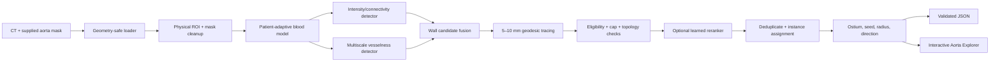

# Meet Patel's Branchseed Master Plan

**Owner:** Meet Patel (`meetshooter123`)  
**Project:** Battle of the Schools — Toralis Labs / Branchseed Challenge  
**Created:** September 12, 2026  
**Purpose:** A shared technical and execution plan. The filename is intentionally namespaced to Meet so teammates can create their own notes without merge conflicts.

> This is a hackathon research prototype, not validated medical software and not a substitute for clinician review.

---

## 1. Executive decision

### The recommendation

Build a **classical-first hybrid system**, then add a **small learned candidate reranker** only if usable daughter-branch labels become available.

The winning shape is:

1. robustly load and normalize each CT/mask in physical space;
2. use the supplied aorta mask as a very strong search anchor;
3. estimate the patient's contrast-filled blood appearance from inside that mask;
4. combine adaptive intensity, multiscale vesselness, wall connectivity, and path geometry to generate high-recall branch candidates;
5. trace each candidate 5–10 mm away from the wall and reject anything that does not behave like a real direct daughter;
6. optionally use a lightweight ML model to rank those candidates and suppress hard false positives;
7. calculate the ostium, 5 mm seed, direction, and radius from the traced proximal path;
8. expose every decision in a clinician-friendly 3D explorer plus synchronized CT views.



### Why not start with a full 3D neural network?

Meet's instinct to hide some cases, train on most, and iterate is good **when labels exist**. The repository currently has 25 CTs and parent-aorta masks, but no daughter labels or reference JSON. Training a daughter detector from those pairs alone is not supervised learning: the target is absent. A full 3D model would also be vulnerable to overfitting, require expensive annotation/training, and still has to run on four CPU cores, 8 GB RAM, without internet, at roughly 60 seconds per case.

Recent aortic segmentation benchmarks do validate the value of nnU-Net, cascades, augmentation, and topology-aware losses, but their setting is different: AortaSeg24 supplied dozens of expertly labeled 3D CTAs and the leading teams trained with development GPUs. The [AortaSeg24 analysis](https://arxiv.org/abs/2502.05330) reports that all top five systems used nnU-Net variants, often coarse-to-fine. That is evidence for an **optional transfer-learning experiment**, not evidence that training a network from these 25 unlabeled cases should be our first move.

The strongest practical approach for this event is therefore:

- **Guaranteed submission path:** explainable, self-calibrating image processing and graph tracing.
- **Accuracy upgrade:** ML ranks a small number of generated candidates rather than segmenting every voxel from scratch.
- **Research stretch:** pretrained aortic models provide auxiliary probabilities or pseudo-labels if rules, licensing, compute, and time allow.

### Priority ranking

| Approach | Accuracy upside | Hackathon feasibility | CPU deployment | Label need | Recommendation |
|---|---:|---:|---:|---:|---|
| Adaptive intensity + vesselness + graph tracing | High | High | High | None | **Build first** |
| Hybrid above + learned candidate reranker | Very high | Medium–high | High | Point/path labels | **Best final target** |
| Tiny local 2.5D/3D patch model | High | Medium | Medium–high | More labels | Try after baseline |
| Transferred AortaSeg/TotalSegmentator prior | Medium–high | Medium | Low–medium | External weights | Optional experiment |
| Full 3D nnU-Net trained only here | Uncertain | Low | Low | Dense labels | Do not bet submission on it |
| Visualization-only submission | Low scoring | High wow factor | High | None | Pair with real detector |

---

## 2. What the system must actually solve

The [Branchseed challenge brief](https://docs.google.com/document/d/1oRb2R9pauvsC-9hDIfr23ojLx90JpCt0jVZjCD5l5Cg/edit) is narrower than full vascular-tree segmentation:

- Input: one CT volume and one binary mask containing only the parent abdominal aorta.
- Find every **eligible artery whose lumen connects directly to that parent**.
- Return each direct daughter once, without anatomical naming.
- A daughter is eligible only when its contrast-filled lumen can be followed at least 5 mm beyond the wall and meets the organizer's minimum size.
- Trace the proximal daughter for up to 10 mm or until its first downstream bifurcation.
- Return physical-millimetre coordinates, never raw voxel indices.
- The terminal iliac division is outside the core task unless the optional extension is enabled.

Required output per daughter:

```json
{
  "instance_id": "branch_001",
  "parent_instance_id": "aorta",
  "ostium_xyz_mm": [12.4, -31.8, 184.6],
  "seed_xyz_mm": [15.1, -29.7, 181.2],
  "radius_mm": 2.7,
  "direction_xyz": [0.56, 0.43, -0.71]
}
```

The scoring priorities should shape development effort:

| Score component | Weight | Engineering implication |
|---|---:|---|
| Branch discovery | 45% | Candidate recall and duplicate/false-positive control dominate. |
| Ostium localization | 25% | Project the path-wall crossing accurately; do not report a nearby centerline point. |
| Daughter quality | 15% | Correct 5 mm seed, direction, and local radius matter after discovery. |
| Compute efficiency | 10% | Crop early, process in physical units, avoid full-body deep inference. |
| Reproducibility | 5% | Deterministic output, pinned dependencies, one run command, validation. |

**Optimization rule:** first maximize branch F1, then improve ostium distance, then refine the daughter measurements. A beautiful radius estimate cannot recover a missed branch.

---

## 3. Verified facts about our actual dataset

These are measurements from the checked-in files, not assumptions.

### 3.1 Two acquisition domains

- `subject001`–`subject015`: 0.625–0.961 mm in-plane spacing and 0.8 mm through-plane spacing.
- `subject016`–`subject025`: 1.5 mm isotropic spacing.
- All 25 volumes have different matrix sizes.
- There are two image direction/orientation groups.

Consequences:

- Every spatial parameter must be expressed in **millimetres**, not voxels.
- Patient-level splitting must include both resolution domains in train/validation/test.
- Any learned model needs spacing, blur, and scale augmentation.
- A one-voxel daughter in the 1.5 mm cohort may span two or more voxels in the higher-resolution cohort.

### 3.2 Contrast varies too much for one HU threshold

The median intensity inside the supplied aorta ranges from **80 HU to 564 HU**. Several masks have broad or multimodal intensity distributions; for example, `subject024` has approximately -110/80/262 HU at its 5th/50th/95th percentiles, while `subject021` is approximately 172/564/667 HU.

Consequences:

- A threshold like `CT > 200 HU` will fail entire cases.
- Estimate the contrast-filled blood class per case, ideally per longitudinal region.
- Separate lower-intensity lumen/partial-volume evidence from high-intensity calcium or bone.
- Normalize candidate features relative to the patient's blood model, not only absolute HU.

This agrees with prior CTA centerline work: contrast-filled blood intensity changes by patient and acquisition timing, so histogram-derived parameters are safer than a fixed range ([Lidayová et al.](https://pmc.ncbi.nlm.nih.gov/articles/PMC5408161/)).

### 3.3 Parent coverage varies dramatically

The largest physical mask span ranges from about **48 mm to 343.5 mm**. Short scans genuinely contain fewer possible daughters; long scans can contain more.

Consequences:

- Never guess an expected branch count or fixed named anatomy.
- Never force every scan to contain celiac, SMA, renal arteries, etc.
- Sort IDs deterministically, but do not infer a branch because its usual anatomical neighbor exists.

### 3.4 Cropped ends are a major trap

The aorta mask reaches a volume face in `subject001`–`subject024`. `subject025` does not touch a volume face, but the supplied mask still has artificial ends.

Consequences:

- Do not define a cap as “where the mask touches the image border” only.
- Find both endpoints along the **parent centerline**, estimate each local cap plane, and suppress candidate openings close to those planes.
- Do not assume voxel `z` is always the anatomical superior-inferior direction.

### 3.5 Some masks are not one clean component

Five masks have multiple 3D connected components:

- `subject008`: 2 components; largest is 99.866%.
- `subject010`: 13 components; largest is 99.950%.
- `subject015`: 2 components; largest is 99.999%.
- `subject018`: 2 components; largest is only 91.107%.
- `subject023`: 4 components; largest is 99.418%.

Consequences:

- Removing tiny islands is sensible, but blindly keeping only the largest component may discard a meaningful 8.9% segment in `subject018`.
- Classify components by physical volume, alignment, distance, and endpoint continuity. Join plausible aortic segments or process their union; remove only proven islands.
- Record cleanup decisions in debug output.

### 3.6 Input-file defects must be solved before algorithm work

- All image/mask grids align when they can be read.
- `subject016`–`subject025` are gzip streams saved with a `.nii` suffix rather than `.nii.gz`.
- SimpleITK fails to infer those files from the suffix.
- `subject024` additionally has a non-orthogonal NIfTI `sform`. ITK rejects it by default; `ITK_NIFTI_SFORM_PERMISSIVE=1` allows loading with a warning and an orthogonalized direction.
- The current `run.py` and teammate-created `viz.py` use direct `sitk.ReadImage(path)`, so they do not yet run across the entire checked-in dataset.
- The scaffold currently derives `case_id` from `orig1.nii` as `orig1`; the desired identifier is normally the subject/case ID, such as `subject001`.

**Priority-zero acceptance gate:** all 25 pairs must load, preserve a consistent physical frame, and produce valid JSON before detector tuning begins.

A robust reader should:

1. detect unresolved Git LFS pointers and emit a useful error;
2. inspect the first two bytes for gzip magic (`1f 8b`);
3. stage a misnamed compressed stream under a temporary `.nii.gz` filename;
4. establish the ITK non-orthogonal-sform policy before reading;
5. load image and mask through the same policy;
6. verify size, spacing, origin, and direction within tolerance;
7. retain the original image object as the source of final physical-coordinate conversion;
8. ask the organizer how `subject024` is expected to be interpreted before treating permissive orthogonalization as final.

### 3.7 Local vesselness timing is promising

A quick benchmark cropped each scan to a 20 mm margin around the aorta and ran three scales (`sigma = 1, 2, 3`) on the current Mac:

| Case | ROI voxels | 3D Frangi | 3D Sato |
|---|---:|---:|---:|
| `subject001` | 1.01 M | 4.41 s | 4.19 s |
| `subject018` | 1.61 M | 7.04 s | 6.75 s |
| `subject025` | 1.60 M | 6.95 s | 6.72 s |

These are directional local measurements, not organizer-machine guarantees. They show that **one** multiscale Hessian filter in a tight ROI is plausible within a 60-second budget; running many filters over the full CT is not.

---

## 4. Detailed hybrid algorithm

## Stage 0 — Determinism, configuration, and observability

Before image processing:

- Set a global random seed.
- Put every tunable value in one config, in physical units.
- Store timing for each stage.
- In development mode, save compact intermediate evidence: cleaned mask, blood model, vesselness, candidate table, accepted paths, rejection reasons.
- In evaluation mode, write only the required prediction file unless debug output is requested.
- Sort accepted branches deterministically by parent-centerline position and circumferential angle before assigning `branch_001`, `branch_002`, ... .

Suggested initial config ranges, to tune on validation data rather than hard-code as truth:

| Parameter | Initial value/range | Reason |
|---|---:|---|
| ROI margin | 20–30 mm | Captures proximal daughters without processing the abdomen. |
| Working spacing | 1.0 mm isotropic | Simplifies distance/path operations; still manageable in ROI. |
| Denoising sigma | 0.5–0.8 mm | Reduce noise while protecting small vessels. |
| Vesselness scales | 0.8–3.5 mm | Cover small-to-medium daughter radii; benchmark subsets first. |
| Outer wall shell | 0–2.5 mm | Candidate opening/contact region. |
| Required outward path | 5 mm | Defined by challenge. |
| Measurement trace | up to 10 mm | Defined by challenge. |
| Cap exclusion | 5–10 mm or ~2 local parent radii | Tune; must reject flat crop ends. |
| Candidate merge distance | 2–4 mm surface-aware | Must remove duplicates without merging nearby true ostia. |
| Minimum daughter size | config placeholder | Await organizer's final threshold. |

## Stage 1 — Geometry-safe loading

Keep two coordinate spaces explicit:

- **Original space:** organizer-provided physical coordinate system; all final output is measured here.
- **Working space:** cropped and optionally resampled ROI used for filters and path finding.

Maintain tested transforms in both directions. SimpleITK arrays use `(z, y, x)` indexing, while `TransformIndexToPhysicalPoint` expects `(x, y, z)`. A silent axis swap can produce plausible-looking but completely wrong coordinates.

Validation at load time:

- both images are 3D;
- mask is non-empty and binarized as `mask > 0`;
- image/mask sizes match;
- spacing is positive;
- transforms contain finite values;
- image/mask physical corners agree within a small tolerance;
- output directory is writable;
- no unresolved LFS pointer remains.

## Stage 2 — Parent-mask cleanup and parent coordinate frame

1. Label all connected components in physical space.
2. Remove only tiny isolated components based on mm³ and separation.
3. For substantial separated components, determine whether they form a plausible continuation of the same aorta using endpoint distance, principal direction, and intensity continuity.
4. Fill small interior holes and apply at most a mild physical closing. Over-aggressive closing can alter the supplied wall and shift ostia.
5. Compute a physical signed distance map with image spacing enabled.
6. Extract a parent centerline or smooth center curve.
7. Estimate local tangent and radius along that center curve.
8. Identify both artificial parent endpoints and their local cap planes.

Fast centerline choices, in order:

- distance-transform ridge / 3D skeleton followed by graph pruning;
- centroid-by-orthogonal-bin spline using a physical PCA axis;
- VMTK only if packaging and runtime are acceptable.

For this challenge, the parent centerline is primarily a coordinate frame for cap suppression, deterministic sorting, and visualization. It need not be a perfect full clinical centerline.

## Stage 3 — Physical ROI and working grid

- Build a physical bounding box around the cleaned parent mask plus a 20–30 mm margin.
- Keep the full parent length; crop only surrounding anatomy.
- Resample CT linearly and mask with nearest-neighbor interpolation to roughly 1 mm isotropic spacing.
- Preserve the original-to-working transform.
- Clip extreme CT values only for numeric/filter stability, never destructively alter the original data.
- Apply mild Gaussian or curvature-preserving denoising.

Why resample: all branch definitions are in millimetres, and the source data spans 0.625–1.5 mm. Isotropic working space makes a 5 mm path, cross-sectional radius, shell thickness, and filter scale comparable across cases. Upsampling the 1.5 mm scans does not create detail, so confidence should still account for native resolution.

## Stage 4 — Patient-adaptive blood model

A single global threshold is unacceptable. Build a per-case lumen model from the supplied parent:

1. Erode the mask by approximately 1–2 mm to reduce wall and partial-volume contamination.
2. Sample CT intensity from that core.
3. Winsorize extreme tails or explicitly model calcium as a high-intensity class.
4. Inspect robust percentiles and histogram modes.
5. If the histogram is multimodal, use multi-Otsu or a small Gaussian mixture to distinguish low-intensity thrombus/partial volume, contrast-filled lumen, and high-intensity calcium.
6. Select the contrast-filled blood mode using spatial coherence and the upper-central distribution rather than blindly using the global median.
7. Optionally estimate the model in overlapping bins along the parent centerline to handle longitudinal bolus variation.

Generate a soft intensity likelihood `P_blood(x)` rather than one binary mask. A broad asymmetric likelihood is safer: partial-volume daughter voxels often fall below parent-core intensity, while calcium and bone can be much brighter.

Useful normalized features include:

- `(HU - blood_median) / blood_MAD`;
- percentile rank within the parent-core histogram;
- distance to the selected blood mode;
- local contrast against a ring around the candidate;
- fraction of very-high-HU voxels suggesting calcium/bone.

## Stage 5 — Two complementary vessel detectors

### Detector A: adaptive intensity and connectivity

Create permissive high-blood-likelihood foreground outside the parent. Keep structures that:

- touch the 0–2.5 mm outer wall shell;
- continue away from the wall;
- have plausible physical cross-section;
- remain connected under 26-neighborhood or a small gap-tolerant rule.

This detector is strong at an ostium, where the daughter merges into the aortic blob and Hessian tubularity can weaken.

### Detector B: multiscale tubularity

Run one 3D Frangi **or** Sato filter over the tight ROI. These filters analyze Hessian eigenvalues over multiple scales to enhance locally tubular structures; scikit-image supports both in 3D ([ridge-filter documentation](https://scikit-image.org/docs/0.25.x/auto_examples/edges/plot_ridge_filter.html), [Frangi API](https://scikit-image.org/docs/0.25.x/api/skimage.filters.html#skimage.filters.frangi)).

Important details:

- Detect bright ridges (`black_ridges=False`).
- Express scales in physical terms after resampling.
- Do not demand high vesselness exactly at the wall junction.
- Look for strong vesselness 2–10 mm beyond the proposed opening.
- Benchmark Frangi versus Sato; do not run both in production unless the measured gain justifies the time.

### Fusion

Use a soft score, not a brittle boolean intersection. Initial form:

```text
P_vessel = wI * P_blood
         + wV * P_tubularity
         + wC * P_local_contrast
         + wG * P_directional_coherence
```

At the wall, weight intensity/connectivity more. Farther outward, weight tubularity and directional continuity more. Tune weights on validation annotations.

## Stage 6 — Wall-origin candidate generation

Let `D_parent(x)` be signed physical distance from the parent wall, positive outside.

1. Form the wall shell `0 < D_parent <= 2.5 mm`.
2. Find surface patches where permissive vessel foreground contacts the shell.
3. For each patch, search outward for 5–10 mm of supporting evidence.
4. Split merged surface patches with watershed/local maxima when two distinct openings have separate outward paths.
5. Merge multiple noisy peaks that feed the same proximal path.
6. Reject patches in the cap exclusion zones.

A candidate should not be accepted merely because one bright voxel touches the wall. It needs a coherent path that becomes tubular away from the junction.

Potential wall score:

```text
S_wall(p) = contact_strength(p)
          + best_outward_path_support(p, 0..10 mm)
          + distal_tubularity(p, 2..10 mm)
          - cap_penalty(p)
          - blob_penalty(p)
          - high_HU_bone_penalty(p)
```

## Stage 7 — Constrained path tracing

For each candidate, trace from the wall into the daughter on a voxel graph or subvoxel graph.

A practical edge/node cost is:

```text
cost(x) = -log(epsilon + P_vessel(x))
        + lambda_curve * curvature_penalty
        + lambda_back * inward_or_tangential_penalty
        + lambda_parent * parent_hugging_penalty
        + lambda_bone * extreme_HU_penalty
```

Use A*, Dijkstra, fast marching, or ordered-upwind propagation in a local 12–20 mm box. Search for endpoints that reach at least 5 mm geodesic distance beyond the wall. The path should generally increase its distance from the parent rather than travel along the aortic wall.

Classical vascular literature supports this combination of adaptive intensity, multiscale medialness, graph connection, and anatomy-based pruning. A cascading CTA centerline system achieved useful small-vessel recovery by specializing passes for vessel sizes and pathologies and then pruning implausible graph branches ([Lidayová et al.](https://pmc.ncbi.nlm.nih.gov/articles/PMC5408161/)). VMTK similarly derives central paths using surface/Voronoi geometry and minimal paths ([3D Slicer VMTK centerlines](https://www.slicer.org/wiki/Modules:VMTKCenterlines)).

Acceptance conditions:

- path arc length beyond the wall is at least 5 mm;
- local radius meets the organizer's minimum once provided;
- blood/tubularity support persists rather than appearing at one voxel;
- path is not an endpoint cap;
- path does not immediately re-enter the parent;
- path is not merely tangent to the wall;
- curvature and radius evolution are plausible at native resolution;
- candidate is not a downstream branch of another accepted daughter.

Stop measurement at 10 mm or first downstream bifurcation, whichever comes first.

## Stage 8 — Direct-daughter topology and edge cases

### Common trunk

One opening at the wall is one direct daughter even if the path splits shortly afterward. Detect the wall contact before analyzing downstream graph degree. Stop the proximal trace at that first split.

### Two nearby ostia

Two separate wall openings must survive as two instances. Do not use a single large Euclidean NMS radius. Merge only when candidates share:

- almost the same surface opening;
- the same first several millimetres of path;
- compatible direction and radius.

Use distance along the parent surface or centerline frame, not only 3D straight-line distance.

### Vessel from another daughter

Build a branch graph rooted at the parent. Only graph edges whose first crossing leaves the parent wall are direct daughters. A later edge whose parent is an already accepted daughter is not reported separately.

### Cropped caps

Use parent-centerline endpoint distance and local cap-plane normal. A true daughter has a lateral wall opening followed by an outward path; a cap candidate occupies much of the parent cross-section and aligns with parent continuation.

### Iliac terminal division

Put this behind `--include-iliac-extension` or a config flag. Keep it disabled for core scoring unless the organizers confirm otherwise.

### No visible branches

Return `"daughters": []`. Never insert an anatomically expected branch without image evidence.

## Stage 9 — Measurement extraction

### Ostium centre

Find where the accepted proximal centerline crosses the zero level of the parent signed-distance map. Interpolate the crossing in physical space. Refine it to the weighted centroid of the connected opening on the wall, constrained to remain near that crossing.

### Daughter seed

Parameterize the proximal path by physical arc length and interpolate the point exactly **5 mm from the ostium along the daughter path**. Do not use “5 voxels” and do not merely draw a Euclidean 5 mm ray through a curved branch.

### Initial direction

Fit a robust line/PCA to centerline points roughly 1–5 mm after the ostium, or use the vector from ostium to the 5 mm seed. Orient it outward and normalize in physical coordinates:

```text
direction = (seed_mm - ostium_mm) / ||seed_mm - ostium_mm||
```

For curved paths, a robust tangent fit is preferable; the ostium-to-seed vector is the stable fallback.

### Radius

Locally segment the daughter around the traced path. At the seed:

- use the physical distance transform at a centered lumen point; or
- sample a cross-sectional plane normal to the tangent and calculate equivalent radius `sqrt(area / pi)`.

Use a short 4–6 mm neighborhood median if a single slice is noisy, but preserve the definition as the local radius at the seed. Keep every distance computation spacing-aware.

### Physical coordinates

Convert the final original-space continuous indices using the original image geometry. For exact integer indices, the challenge explicitly requests `SimpleITK.TransformIndexToPhysicalPoint`. For subvoxel estimates, use the corresponding continuous-index transform, or document/verify the interpolation convention with the organizers.

## Stage 10 — Deduplication, confidence, and deterministic IDs

For every accepted path, retain features and a confidence score. Candidate features:

| Group | Features |
|---|---|
| Intensity | Blood likelihood mean/min/quantiles, local contrast, calcium fraction |
| Tubularity | Mean/max vesselness, scale of maximum response, coherence |
| Path | Length, cost/mm, monotonic outward progress, curvature, tortuosity |
| Ostium | Contact area, opening circularity, wall angle, cap distance |
| Radius | Seed radius, radius stability, native-voxel support |
| Topology | Shared-prefix length, branch degree, parent/daughter relationship |
| Quality | Native spacing, blood-model certainty, component-cleanup uncertainty |

Deduplicate using both ostium and shared-path similarity. Then sort by parent-centerline arc position and circumferential angle. IDs must be unique and reproducible; they do not need to be anatomically stable names.

Confidence is useful for the UI and debugging even if it is omitted from strict organizer JSON. Put extra fields in a separate debug file unless the organizer confirms that unknown JSON keys are accepted.

---

## 5. The ML plan — how to use the 25 scans correctly

## 5.1 First acquire labels

Before training anything, ask for the promised development reference outputs. If none are supplied, create point/path annotations:

- ostium center;
- centerline points for the first 5–10 mm;
- approximate radius at 5 mm;
- branch eligibility flag;
- optional confidence/reviewer note.

Full daughter voxel masks are expensive and unnecessary for a candidate classifier. Two people should independently review ambiguous origins, then reconcile. 3D Slicer Markups can accelerate point/path annotation.

**Decision rule:**

- 0–4 labeled cases: stay classical; labels are for visual tuning only.
- 5–9 labeled cases: train only a simple candidate classifier with cross-validation.
- 10+ diverse labeled cases: candidate classifier plus a tiny local patch model becomes reasonable.
- Dense external labels + approved GPU/time: test transfer learning, never remove the classical fallback.

## 5.2 Holdout and cross-validation

Meet's “keep some hidden” idea is correct. Use a patient-level split, never a slice/patch split.

Recommended protocol after labels exist:

1. Lock **5 cases** as a final local holdout before tuning.
2. Stratify that holdout across the high-resolution and 1.5 mm cohorts, short/long coverage, low/high contrast, and mask-quality difficulty.
3. Use the other 20 cases in **five-fold patient-level cross-validation** for feature, threshold, and model selection.
4. Never inspect holdout errors during iteration. Run it once when the pipeline is frozen.
5. Record the split and seed (`20260912`) in the repository.

Do not choose a split based on which cases the current algorithm already handles well. If branch-count labels arrive, balance branch-count distributions too.

## 5.3 Candidate classification is the highest-return ML target

The classical pipeline can turn millions of voxels into perhaps tens of plausible openings per case. The learned model then answers a much easier question: **is this candidate a real direct daughter?**

Training examples:

- Positive: generated candidate matches a reference ostium/path.
- Hard negative: high-scoring candidate rejected by reference, especially veins, bone, calcium, caps, and duplicate wall peaks.
- Easy negative: randomly sampled wall sites, heavily downsampled so they do not dominate.

Start with:

1. regularized logistic regression as a sanity baseline;
2. random forest or histogram gradient boosting over engineered features;
3. calibrated probability threshold selected for branch F1;
4. only then a tiny CNN.

Tree models are excellent hackathon candidates because they train quickly, expose feature importance, handle nonlinear interactions, and infer almost instantly on CPU.

## 5.4 Tiny patch model option

If enough labels exist, extract a fixed physical patch around each candidate, oriented using parent tangent and wall normal. Channels:

1. patient-normalized CT;
2. aorta mask;
3. signed distance to parent wall;
4. vesselness;
5. candidate path/evidence mask.

Model options:

- three orthogonal 2D views through the candidate feeding a small shared CNN (2.5D);
- a shallow 3D CNN over a 24–32 mm patch;
- a small local U-Net if proximal lumen masks can be annotated.

Augmentation:

- rotations around the wall normal;
- small translations in mm;
- intensity shift/scale and gamma;
- blur/downsample to mimic 1.5 mm scans;
- Gaussian/Poisson noise;
- mask-boundary perturbation;
- random small gaps to improve partial-volume robustness.

Loss and sampling:

- class-balanced BCE or focal loss for candidate classification;
- Dice + BCE for local segmentation;
- optionally soft-clDice or Skeleton Recall loss when centerline connectivity matters. These topology-aware losses were designed to protect thin tubular connectivity ([clDice](https://arxiv.org/abs/2003.07311), [Skeleton Recall Loss](https://arxiv.org/abs/2404.03010)).

Keep the model small enough that all candidate patches infer comfortably under the CPU budget. Export weights with the repository and test with network access disabled.

## 5.5 External-data and pretrained-model experiments

### AortaSeg24

The [AortaSeg24 resource](https://aortaseg24.grand-challenge.org) contains 100 CTAs annotated for 23 aortic branches/zones; 50 labeled cases were used in its development phase. Top systems used coarse-to-fine nnU-Net variants, strong augmentation, and topology/boundary-aware losses ([challenge paper](https://arxiv.org/abs/2502.05330)).

Possible uses:

- pretrained feature encoder for local candidate patches;
- auxiliary “aortic branch probability” map;
- pseudo-label generator for likely major branches;
- pretraining a vessel-vs-background local segmentor.

Risks:

- different disease population, field of view, annotation definitions, and branch naming;
- exact weights may not be available or licensed for redistribution;
- challenge rules may restrict external data;
- whole-volume inference may violate runtime/memory limits;
- it may miss unnamed/accessory branches that Branchseed expects.

### TotalSegmentator

[TotalSegmentator](https://arxiv.org/abs/2208.05868) was trained on diverse CT exams and segments many structures, including a small set of vessels. It may provide coarse anatomy, bone, vena-cava, or vessel priors during development. It should not be a mandatory runtime dependency unless measured end-to-end on the four-core/8 GB target and bundled legally. Its most useful role may be producing offline pseudo-labels or negative-anatomy masks.

### Rule for every external model

Before integration, verify:

- external data are allowed;
- license permits use and redistribution;
- weights can be bundled offline;
- CPU runtime and peak memory;
- coordinate preprocessing;
- measurable cross-validation gain over the hybrid baseline.

No external model enters the final path merely because it is “state of the art.”

## 5.6 Ensemble strategy

The best affordable ensemble is algorithmic diversity, not five large neural networks:

- intensity/connectivity candidate score;
- vesselness/geodesic candidate score;
- optional learned candidate probability.

Take the union for recall, then use path-aware deduplication and calibrated ranking for precision. Analyze candidates accepted by only one detector; those disagreements are the best hard-negative and failure-analysis set.

---

## 6. Evaluation and iteration system

## 6.1 Local matching

Implement one-to-one Hungarian matching between predicted and reference daughters using physical ostium distance. Because the organizer's final matching tolerance is not stated, report curves at several thresholds (for example 2, 3, 5, and 8 mm) rather than tuning to one guessed cutoff.

Per case and aggregate:

- true/false positives and false negatives;
- precision, recall, F1;
- branch-count absolute error;
- ostium Euclidean error in mm;
- seed-to-reference-path distance;
- direction angular error `acos(clamp(dot(pred, ref)))`;
- radius absolute and relative error;
- runtime and peak resident memory;
- invalid-output count.

Report metrics separately for:

- high-resolution vs 1.5 mm cohorts;
- low-, medium-, and high-contrast cases;
- short vs long parent coverage;
- single- vs multi-component masks;
- branches near parent caps;
- small vs larger daughters once thresholds are known.

Small datasets produce unstable means. Include medians, per-case tables, and bootstrap confidence intervals.

## 6.2 Experiment ladder

Change one concern at a time:

| ID | Experiment | Question |
|---|---|---|
| E0 | Geometry-safe loader + empty valid output | Can all 25 cases run reproducibly? |
| E1 | Adaptive intensity/contact components | How much recall is available without vesselness? |
| E2 | Add one vesselness filter | Does distal tubularity improve real-branch recall? |
| E3 | Add 5–10 mm minimum-cost tracing | How many blobs/caps/veins disappear? |
| E4 | Add cap model and direct-daughter graph | Are topology edge cases handled? |
| E5 | Improve ostium crossing and radius | Does localization/quality improve without hurting F1? |
| E6 | Rule-score calibration | What is the best precision/recall operating point? |
| E7 | Learned candidate reranker | Does ML beat E6 on patient-level CV? |
| E8 | External pretrained prior | Does it add value after runtime and domain shift? |
| E9 | Ensemble | Is the gain worth complexity and time? |

For every experiment, log:

- git commit;
- config hash;
- train/validation split;
- per-case metrics;
- runtime/memory;
- screenshots of one success and one failure;
- decision: keep, revert, or investigate.

## 6.3 Error taxonomy

Every false result should enter one bucket:

1. parent crop cap;
2. duplicate peak at one ostium;
3. two true nearby ostia merged;
4. daughter of a daughter counted as direct;
5. adjacent vein;
6. bone/calcification;
7. bright organ or contrast artifact;
8. branch too short or below size rule;
9. low contrast / partial-volume disappearance;
10. parent mask gap/component issue;
11. wrong coordinate transform;
12. common trunk split incorrectly;
13. iliac terminal division;
14. path follows wall rather than daughter.

The next experiment should target the largest validation error bucket, not the most interesting algorithm.

## 6.4 Runtime budget

Target a **45-second median** to preserve headroom under a possible 60-second average limit.

| Stage | Target |
|---|---:|
| Robust load + validation | 1–4 s |
| Crop, resample, distance maps | 2–5 s |
| Blood model + denoise | 1–3 s |
| One multiscale vesselness pass | 5–12 s |
| Candidate generation | 2–5 s |
| Local path tracing | 8–15 s |
| Measurements + dedupe | 2–5 s |
| JSON validation | <1 s |
| **Planned total** | **21–50 s** |

Optimization order:

1. crop more tightly while retaining 10 mm paths;
2. calculate expensive maps only in the ROI;
3. use float32 and compact booleans;
4. evaluate fewer physically meaningful scales;
5. trace in local boxes per candidate;
6. prune weak candidates before graph search;
7. cache reusable distance/intensity maps;
8. parallelize independent candidates carefully within four cores;
9. avoid copying full volumes repeatedly.

Measure peak memory with realistic long cases, especially `subject025`.

---

## 7. Visualization master plan — “Aorta Explorer”

Meet's idea is a strong differentiator. The anatomically correct term here is exploring inside the **aorta and daughter arteries**, not veins. The visualization should be impressive **and** prove the detector is trustworthy.

The existing `viz.py` already produces orthogonal slices and MIPs with optional ostium/direction overlays. Preserve that work. Build the interactive experience as an additional entry point so teammates do not collide in one file.

## 7.1 Core experience

### Mode A — External 3D branch map

- translucent parent-aorta surface;
- each daughter as a separate colored proximal segment;
- sphere/ring at each ostium;
- 5 mm seed marker;
- direction arrow;
- radius-proportional tube;
- deterministic `branch_###` labels;
- click/hover card with coordinates, radius, confidence, evidence, and warnings;
- one-click “focus branch” camera transition.

### Mode B — Synchronized clinical evidence

Four linked panels:

- axial CT;
- coronal CT/MIP;
- sagittal CT/MIP;
- interactive 3D model.

Clicking a branch moves all crosshairs to its ostium. Controls toggle:

- parent mask;
- candidate probability;
- vesselness;
- accepted path;
- rejected candidates;
- uncertainty;
- local 5 mm measurement plane.

This view turns the model from a black box into reviewable evidence, a key theme in real clinical AI workflows. The 2025 BRAVE aortic-analysis pipeline similarly combines automated segmentation/measurements with inspectable 3D outputs and landmarks ([BRAVE paper](https://pmc.ncbi.nlm.nih.gov/articles/PMC12069616/)).

### Mode C — Virtual angioscopy / first-person fly-through

- camera travels along a smoothed parent centerline;
- look-ahead direction follows the local tangent;
- ostia glow or receive doorway-style labels as they approach;
- selecting an ostium branches the camera into that daughter for up to 10 mm;
- speed slider, pause, reverse, and “next daughter” controls;
- mini-map shows current position in the whole aorta;
- collision/near-wall guard prevents camera clipping;
- optional automatic narrated tour for the demo.

Endoluminal navigation from CT-derived vascular surfaces is an established visualization concept, often called virtual angioscopy ([example clinical report](https://www.ahajournals.org/doi/full/10.1161/CIRCULATIONAHA.108.795500)). Our version uses it to explain algorithmic branch discovery, not to claim clinical clearance.

### Mode D — Unwrapped aortic-wall ostium map

Create a 2D “subway map” of the parent surface:

- vertical axis: arc length along parent centerline;
- horizontal axis: circumferential angle around the local centerline frame;
- one marker per ostium;
- marker size: daughter radius;
- marker color: confidence or vesselness;
- cap exclusion bands shown at both ends;
- click marker to jump to MPR/3D/fly-through.

This is highly useful because nearby origins become easy to compare without rotating a complex 3D surface. It also immediately exposes duplicate detections.

## 7.2 Additional “wow” ideas

1. **Discovery animation:** replay the pipeline—parent mask, wall scan, candidate sparks, traced paths, final branches.
2. **Evidence halo:** show a small cone beyond each ostium colored by accumulated path probability.
3. **Confidence weather map:** green/high confidence, amber/review, red/rejected; never hide uncertainty.
4. **Branch passport:** one compact card per daughter with ostium, seed, radius, direction, path quality, and local CT thumbnail.
5. **Before/after slider:** raw CT vessel rendering versus extracted parent/daughters.
6. **Ghost candidates:** toggle rejected candidates and display the exact rejection reason.
7. **Measurement ruler:** render the 5 mm path from ostium to seed and radius disk at the seed.
8. **Coverage timeline:** show parent-centerline length and branch positions to explain why short scans contain fewer daughters.
9. **Algorithm compare mode:** E1 vs E3 vs ML reranker results on the same patient.
10. **Judge autopilot:** a 60–90 second guided tour of three representative cases if live interaction fails.
11. **Self-contained case report:** export an offline HTML plus PNG and JSON.
12. **Optional 3D-print export:** export a clean STL/GLB of the parent and proximal daughters as a stretch feature.

## 7.3 Implementation options

### Fast MVP

- `scikit-image.measure.marching_cubes` for surfaces;
- Plotly `Mesh3d`, `Scatter3d`, and `Cone` for interaction;
- Streamlit or Dash for linked controls;
- package Plotly JS into exported HTML so the demo does not depend on internet.

### Best visual quality

- VTK/PyVista or vtk.js/Three.js;
- export decimated GLB meshes and branch JSON;
- centerline-driven camera animation;
- custom clipping planes and interior materials.

### Coordinate warning

`marching_cubes` returns vertices in array order `(z, y, x)`. They must be reordered and transformed using spacing, direction, and origin. Multiplying by spacing alone is wrong for nontrivial orientation. The same physical transform used by JSON must drive the 3D scene.

### Performance

- crop before meshing;
- decimate surfaces for browser rendering;
- keep the full-resolution path/measurements separate from display geometry;
- cache per-case meshes;
- load only one case at a time;
- provide PNG/video fallback.

## 7.4 Three showcase cases

Choose after the detector is working, but cover distinct difficulties:

1. high-resolution, high-contrast case with multiple clear daughters;
2. 1.5 mm or low-contrast case showing adaptation;
3. difficult case with nearby origins, a common trunk, mask components, or crop-cap suppression.

Do not cherry-pick only perfect examples. Show one honest failure or uncertainty and explain the next mitigation; judges often value understanding over hidden brittleness.

---

## 8. Proposed repository architecture and ownership

Do not create all of this before the baseline works; this is the target separation of concerns.

```text
run.py                              # stable required CLI
branchseed/
  __init__.py
  io.py                             # gzip/LFS/NIfTI/geometry-safe loading
  config.py                         # all parameters in physical units
  geometry.py                       # transforms, ROI, distance maps, centerline, caps
  intensity.py                      # adaptive blood model
  vesselness.py                     # Frangi/Sato wrapper
  candidates.py                     # wall contacts and candidate fusion
  tracing.py                        # graph/fast-marching proximal paths
  measurements.py                   # ostium, seed, direction, radius
  ranking.py                        # rules + optional ML reranker
  schema.py                         # output construction and strict validation
  pipeline.py                       # orchestration and timings
visualization/
  explorer.py                       # interactive UI
  meshes.py                         # physical-space surface generation
  flythrough.py                     # centerline camera path
  wall_map.py                       # unwrapped ostium map
scripts/
  profile_data.py                   # reproducible dataset report
  evaluate.py                       # one-to-one local metrics
  annotate.py                       # reference point/path workflow
  benchmark.py                      # runtime and memory
configs/
  default.json
  fast.json
models/
  README.md                         # weights, license, provenance
  candidate_reranker.*              # only when approved
artifacts/                          # ignored generated outputs
  predictions/
  debug/
  visual_checks/
MEET_PATEL_BRANCHSEED_MASTER_PLAN.md
```

Suggested parallel workstreams:

| Workstream | Deliverable | Collision prevention |
|---|---|---|
| A: I/O/geometry | all 25 cases load and round-trip coordinates | Own `io.py`, `geometry.py` |
| B: detection | intensity/vesselness candidate map | Own `intensity.py`, `vesselness.py`, `candidates.py` |
| C: tracing/measurement | eligible paths and output quantities | Own `tracing.py`, `measurements.py` |
| D: evaluation/ML | labels, matching, feature table, reranker | Own `scripts/evaluate.py`, `ranking.py` |
| E: visualization | explorer, wall map, fly-through | Own `visualization/` |
| F: integration | stable CLI, config, runtime, demo | Coordinate before touching `run.py` |

Because the team requested direct commits to `main`, claim files in Discord, pull before editing, keep commits small, and never force-push. Prefer adding a new module over having three people edit `run.py` simultaneously.

---

## 9. Execution plan from now to submission

## Phase 0 — Ask organizers immediately (10 minutes)

Get answers to the questions in Section 11, especially minimum size and reference-label availability.

## Phase 1 — Never-fail foundation (1–2 hours)

- robustly read all 25 image/mask pairs;
- settle `subject024` geometry handling;
- fix case-ID inference;
- verify image/mask physical corners;
- create schema validator;
- run empty-output smoke test across all 25;
- update visualization loader through coordination with its owner.

**Gate A:** zero crashes, zero invalid JSON, deterministic outputs.

## Phase 2 — High-recall baseline (2–4 hours)

- clean masks conservatively;
- create ROI and signed distance;
- fit adaptive blood model;
- generate intensity-connected wall candidates;
- render candidates on three cases.

**Gate B:** true-looking openings appear in candidate set, even with false positives.

## Phase 3 — Tubularity and eligibility (3–5 hours)

- benchmark Frangi vs Sato on representative cases;
- select one filter/scales;
- implement local outward path search;
- enforce 5 mm continuation;
- add cap exclusion;
- output rough ostium/seed/direction/radius.

**Gate C:** no systematic cap detections; variable branch counts; common cases visually credible.

## Phase 4 — Precision and topology (2–4 hours)

- path-aware deduplication;
- common-trunk handling;
- direct-vs-downstream graph rule;
- radius and ostium refinement;
- per-candidate rejection reasons;
- tune only against labeled development cases.

**Gate D:** branch F1 and ostium error stable across both acquisition cohorts.

## Phase 5 — ML only if justified (2–6 hours in parallel)

- ingest reference/manual points;
- lock split;
- build feature table and hard negatives;
- cross-validate simple reranker;
- integrate only if every fold and runtime improve;
- keep `--ranking rules` fallback.

**Gate E:** no holdout leakage; model and license bundled; network disabled during test.

## Phase 6 — Visualization and story (parallel, 4–8 hours)

- preserve `viz.py` PNG baseline;
- external 3D map + branch selection;
- synchronized local CT evidence;
- unwrapped wall map;
- guided fly-through stretch;
- save three visual checks and one fallback video.

## Phase 7 — Freeze and rehearse (last 2–3 hours)

- clean environment installation;
- complete-set batch run;
- runtime and memory report;
- validate every JSON;
- verify no network requests;
- rehearse five-minute demo twice;
- freeze algorithm parameters;
- push and confirm remote main is current well before deadline.

**Freeze rule:** near submission, fix only crashes, invalid outputs, or proven high-impact regressions. Do not insert a new model at the last minute.

---

## 10. Five-minute demo plan

### 0:00–0:35 — Problem

“Given only a CTA and parent-aorta mask, we discover every directly connected daughter present in this patient's visible scan—without assuming a fixed anatomy.”

Show raw CT + cyan parent mask.

### 0:35–1:20 — Why the task is hard

Show two cases with different spacing/contrast and a cropped cap. State the measured 80–564 HU median range and 48–343.5 mm coverage range.

### 1:20–2:25 — Method

Animate:

1. physical ROI;
2. patient-specific blood calibration;
3. vesselness;
4. wall candidates;
5. 5–10 mm traced paths;
6. cap/topology rejection;
7. final instances.

Explain that ML, if used, ranks candidates rather than hallucinating anatomy.

### 2:25–3:40 — Aorta Explorer

- rotate translucent 3D parent;
- click `branch_002`;
- linked CT views jump to its ostium;
- show 5 mm ruler, seed, radius disk, direction;
- switch to unwrapped wall map;
- fly inside and enter one daughter.

### 3:40–4:25 — Evidence and performance

Show development precision/recall, median ostium error, runtime, and peak memory. Compare baseline vs final ablation, not only the final number.

### 4:25–5:00 — Honest limitations and value

Name the largest remaining failure mode and show confidence/review support. Finish with: a fast, reproducible, machine-readable map that can support surgical-planning workflows while keeping the clinician in control.

---

## 11. Questions for Rishi, bhux, or Toralis mentors

Ask these now; several change the algorithm or evaluation materially:

1. Where is the promised development subset with reference outputs?
2. What is the exact minimum eligible daughter diameter/radius?
3. What ostium distance defines a match before one-to-one assignment?
4. How are seed, direction, and radius scored numerically?
5. Are subvoxel physical points accepted, and should continuous-index transforms be used?
6. Are additional JSON fields such as confidence ignored or rejected?
7. Is the terminal iliac division scored only as an optional extension?
8. Are external public datasets and pretrained weights permitted?
9. Must every dependency/weight be bundled with no download during evaluation?
10. What Python version and package-install policy will the evaluator use?
11. Is `subject016`–`subject025` being gzip data under a `.nii` suffix intentional?
12. What physical-coordinate interpretation should be used for `subject024`'s non-orthogonal `sform`?
13. Can masks contain multiple legitimate parent components, especially `subject018`?
14. Are scans arterial-phase CTA only, or can low-contrast/non-arterial examples appear in hidden evaluation?
15. Will the visual component be judged for clinical utility, originality, or only correctness?
16. Can we receive one organizer baseline output to validate coordinate conventions?

Write the answers into the repo immediately; do not leave them only in Discord.

---

## 12. Major risks and mitigations

| Risk | Likely symptom | Mitigation |
|---|---|---|
| No daughter labels | ML cannot train/evaluate honestly | Build no-label hybrid; request refs; point/path annotation; simple reranker only. |
| Fixed HU threshold | Entire low/high-contrast cases fail | Per-case/per-region blood model and soft likelihood. |
| Misnamed gzip | subjects 016–025 crash | Magic-byte detection and temporary `.nii.gz` staging. |
| Non-orthogonal affine | subject024 crashes or coordinates shift | Confirm organizer policy; permissive ITK path with explicit warning/tests. |
| Axis-order bug | visually plausible but wrong coordinates | Central transform utilities and physical round-trip checks. |
| 1.5 mm partial volume | small daughters disappear | Physical scales, permissive candidate recall, resolution-aware confidence. |
| Bone/calcification | bright tubular false positives | Upper-tail model, tubularity/path rules, connection and anatomy penalties. |
| Adjacent vein | plausible vessel near wall | Require direct wall opening and continuous outward path; optional anatomy prior. |
| Crop caps | giant false branches at endpoints | Parent-centerline endpoint/cap model. |
| Mask components | wrong ROI/centerline | conservative component reasoning; inspect subject018. |
| Nearby ostia | true branches merged | surface/path-aware splitting and conservative NMS. |
| Common trunk | one origin emitted twice | dedupe at wall before downstream bifurcation. |
| Daughter-of-daughter | indirect branch emitted | rooted graph; report only first parent-wall crossings. |
| Pure ML overfit | great train, poor hidden set | patient-level CV, locked holdout, augmentation, classical fallback. |
| Runtime exceeds limit | timeout on long scans | tight ROI, one vesselness method, early pruning, local tracing. |
| UI consumes algorithm time | impressive but inaccurate submission | detector gates first; visualization workstream runs in parallel. |
| Direct-main collision | lost/conflicting work | named ownership, pull often, small commits, never force-push. |

---

## 13. Definition of done

### Required correctness

- [ ] Required CLI works exactly: `python run.py --image ... --aorta-mask ... --output ...`.
- [ ] All 25 checked-in cases load without renaming source data manually.
- [ ] Image/mask geometry is validated.
- [ ] Variable number of branches is supported, including zero.
- [ ] Every branch ID is unique and deterministic.
- [ ] Every `parent_instance_id` equals `aorta`.
- [ ] Every ostium and seed is in original physical millimetres.
- [ ] Every direction is finite, outward, and unit length within tolerance.
- [ ] Every radius is finite, positive, and in millimetres.
- [ ] Seed is 5 mm along the traced path within tolerance.
- [ ] Direct daughters appear once; indirect daughters do not.
- [ ] Crop caps are excluded.
- [ ] Common trunks and nearby separate origins are treated correctly.
- [ ] Empty detections produce valid JSON.

### Evaluation/deployment

- [ ] Fixed patient-level split is committed if ML is used.
- [ ] No holdout leakage.
- [ ] Runtime and peak memory measured on every case.
- [ ] Average runtime is below confirmed limit on four CPU cores.
- [ ] Evaluation works with internet disabled.
- [ ] Dependencies and model weights are pinned and legally redistributable.
- [ ] Fresh environment install and run are documented.
- [ ] No case-specific subject-ID logic exists.

### Visualization/demo

- [ ] At least three required visual checks show mask, ostia, and arrows.
- [ ] Interactive view uses correct physical orientation.
- [ ] Every 3D branch can be tied back to source CT evidence.
- [ ] Uncertainty/rejection evidence is available.
- [ ] Demo has offline PNG/video fallback.
- [ ] Known failures are stated honestly.

---

## Appendix A — Compact case profile

`HU` is the 5th/median/95th percentile inside the supplied mask. `Span` is the largest mask bounding-box dimension in physical mm. “GZ” means gzip content under a `.nii` suffix.

| Case | Spacing xyz (mm) | Aorta HU p05/p50/p95 | Span (mm) | Components | Notes |
|---|---|---:|---:|---:|---|
| subject001 | 0.782/0.782/0.8 | 254/303/339 | 139.2 | 1 | touches volume face |
| subject002 | 0.686/0.686/0.8 | 186/359/400 | 140.8 | 1 | touches volume face |
| subject003 | 0.732/0.732/0.8 | 225/332/372 | 164.8 | 1 | touches volume face |
| subject004 | 0.625/0.625/0.8 | 254/475/513 | 144.0 | 1 | high contrast |
| subject005 | 0.900/0.900/0.8 | 200/255/287 | 148.0 | 1 | lower contrast |
| subject006 | 0.774/0.774/0.8 | 204/267/294 | 166.4 | 1 | lower contrast |
| subject007 | 0.862/0.862/0.8 | 183/248/274 | 124.0 | 1 | lower contrast |
| subject008 | 0.647/0.647/0.8 | 276/416/484 | 140.8 | 2 | largest component 99.866% |
| subject009 | 0.850/0.850/0.8 | 292/411/448 | 125.6 | 1 | high contrast |
| subject010 | 0.961/0.961/0.8 | 295/370/424 | 144.8 | 13 | largest component 99.950% |
| subject011 | 0.839/0.839/0.8 | 248/448/490 | 129.6 | 1 | high contrast |
| subject012 | 0.782/0.782/0.8 | 198/272/315 | 146.4 | 1 | lower contrast |
| subject013 | 0.858/0.858/0.8 | 244/286/322 | 127.2 | 1 | lower contrast |
| subject014 | 0.702/0.702/0.8 | 281/437/483 | 135.2 | 1 | high contrast |
| subject015 | 0.726/0.726/0.8 | 299/431/459 | 134.4 | 2 | second component tiny |
| subject016 | 1.5/1.5/1.5 | 16/229/385 | 147.0 | 1 | GZ; broad intensity |
| subject017 | 1.5/1.5/1.5 | 196/516/567 | 48.0 | 1 | GZ; very short coverage |
| subject018 | 1.5/1.5/1.5 | -57/110/270 | 285.0 | 2 | GZ; largest component only 91.107% |
| subject019 | 1.5/1.5/1.5 | 207/556/710 | 69.0 | 1 | GZ; short/high contrast |
| subject020 | 1.5/1.5/1.5 | 160/487/546 | 67.5 | 1 | GZ; short/high contrast |
| subject021 | 1.5/1.5/1.5 | 172/564/667 | 100.5 | 1 | GZ; highest median HU |
| subject022 | 1.5/1.5/1.5 | 106/236/304 | 210.0 | 1 | GZ; long/lower contrast |
| subject023 | 1.5/1.5/1.5 | 131/367/427 | 54.0 | 4 | GZ; largest component 99.418% |
| subject024 | 1.5/1.5/1.5 | -110/80/262 | 135.0 | 1 | GZ; non-orthogonal sform; lowest median HU |
| subject025 | 1.5/1.5/1.5 | 201/479/536 | 343.5 | 1 | GZ; longest coverage; mask not on volume face |

All cases except `subject025` have mask voxels on at least one volume face. All masks are binary. All image/mask pairs share geometry under the tested loading policy.

---

## Appendix B — Pipeline pseudocode

```python
def solve(image_path, mask_path, output_path, config):
    original_ct, original_mask = load_pair_robustly(image_path, mask_path)
    validate_geometry(original_ct, original_mask)

    parent = clean_parent_mask_conservatively(original_mask, config)
    parent_frame = build_parent_centerline_and_caps(parent)

    working_ct, working_parent, transforms = make_physical_roi(
        original_ct,
        parent,
        margin_mm=config.roi_margin_mm,
        spacing_mm=config.working_spacing_mm,
    )

    signed_parent_distance = physical_signed_distance(working_parent)
    blood_model = fit_patient_blood_model(working_ct, working_parent, parent_frame)
    blood_probability = blood_model.probability(working_ct)

    tubularity = multiscale_vesselness(
        working_ct,
        sigmas_mm=config.vessel_sigmas_mm,
        bright_ridges=True,
    )

    candidates = wall_contact_candidates(
        blood_probability,
        tubularity,
        signed_parent_distance,
        parent_frame,
    )

    proposals = []
    for candidate in candidates:
        path = trace_outward_minimum_cost_path(
            candidate,
            blood_probability,
            tubularity,
            signed_parent_distance,
            max_length_mm=10.0,
        )
        features = describe_candidate(candidate, path, blood_model, parent_frame)
        if passes_eligibility(path, features, min_length_mm=5.0):
            proposals.append((candidate, path, features))

    proposals = enforce_direct_daughter_topology(proposals, parent_frame)
    proposals = path_aware_deduplication(proposals)
    proposals = rank_and_threshold(proposals, optional_model=config.model)

    daughters = []
    for index, proposal in enumerate(deterministic_sort(proposals), start=1):
        measurement = measure_proximal_daughter(proposal, working_ct)
        measurement = transforms.to_original_physical(measurement)
        daughters.append(to_output_instance(index, measurement))

    result = {
        "case_id": infer_case_id(image_path),
        "parent": {"instance_id": "aorta"},
        "daughters": daughters,
    }
    validate_prediction_schema_and_geometry(result)
    atomic_write_json(output_path, result)
```

---

## Appendix C — Research grounding

- The challenge contract and scoring are from the [Branchseed challenge brief](https://docs.google.com/document/d/1oRb2R9pauvsC-9hDIfr23ojLx90JpCt0jVZjCD5l5Cg/edit).
- [AortaSeg24](https://arxiv.org/abs/2502.05330) provides the strongest recent evidence for coarse-to-fine nnU-Net, augmentation, and topology-aware segmentation on labeled aortic branches.
- [BRAVE](https://pmc.ncbi.nlm.nih.gov/articles/PMC12069616/) is a close real-world analogue for combining neural anatomy segmentation, unsupervised intensity/connectivity logic, centerlines, morphology, and interpretable 3D review.
- [Frangi/Sato documentation](https://scikit-image.org/docs/0.25.x/api/skimage.filters.html) supports practical multiscale 3D tubularity filtering.
- [Cascading CTA centerline extraction](https://pmc.ncbi.nlm.nih.gov/articles/PMC5408161/) supports patient-adaptive blood modeling, multiscale nodes, graph connection, and anatomy-based pruning.
- [VMTK in 3D Slicer](https://www.slicer.org/wiki/Modules:VMTKCenterlines) is a reference for centerline, branch topology, minimal-path/Voronoi geometry, and radius extraction.
- A prior [automatic aortic landmark system](https://link.springer.com/article/10.1007/s11517-019-02110-x) demonstrates that branch/root landmarks can be recovered from a segmented aorta with high reported branch-detection precision/recall, supporting the supplied-mask-anchor strategy.
- [TotalSegmentator](https://arxiv.org/abs/2208.05868) is relevant as an optional broad anatomical prior, not as the required core detector.
- [clDice](https://arxiv.org/abs/2003.07311) and [Skeleton Recall Loss](https://arxiv.org/abs/2404.03010) are optional topology-aware objectives if a local neural segmentor is trained.
- [Virtual angioscopy](https://www.ahajournals.org/doi/full/10.1161/CIRCULATIONAHA.108.795500) supports the endoluminal visualization concept.

Content was rephrased for compliance with licensing restrictions. No source is reproduced verbatim beyond short names or technical terms.

---

## Final call

**Ship the adaptive hybrid first.** It directly exploits the one annotation we are guaranteed—the parent mask—while matching the challenge's topology and physical-measurement definitions. Use ML where small data has the most leverage: candidate ranking and local refinement. Make every accepted branch inspectable in 2D, 3D, on an unwrapped wall map, and from inside the lumen. That combination gives the team the best balance of branch accuracy, runtime, reproducibility, originality, and demo impact.
