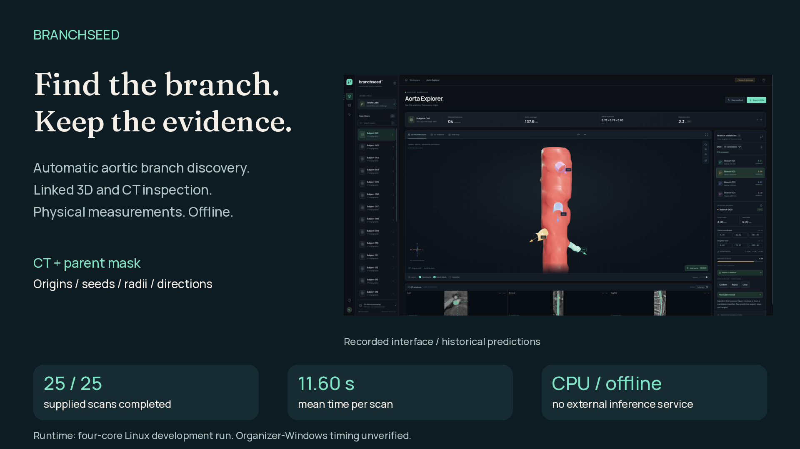

# Branchseed — Toralis Labs Challenge

Detect direct daughter arteries from a CT volume and a supplied parent-aorta mask, and export each opening as a separate branch instance in physical LPS coordinates.

**Current default:** strict + review proposals at native contrast scale **0.9**, bundled logistic filtering at **0.15**, then strict-first merging within **3 mm**. CLI, batch and normal Explorer use this restored workflow. Fresh five-reference replay gives **F1 0.75676 (14 TP / 4 FP / 5 FN)**. Use `--pipeline strict` for the previous 1.2 baseline.

**Judges: [download the standalone fusion application](application/README.md).**
The Windows offline ZIP includes only inference code, its small bundled model
and numeric runtime wheels. No website, Node/npm, matplotlib, training framework
or repository clone is needed. [Exact installation and run commands](application/START_HERE.md).



[Watch the showcase](https://github.com/Coder-Meet/battleoftheschool/releases/download/branchseed-final-2026-09-13/branchseed-showcase.mp4) · [View on Google Drive](https://drive.google.com/file/d/1JvuW4ZvMwT6x4_I_VQ8jplEnPNiR_hV5/view?usp=sharing) · [Devpost copy](DEVPOST_SUBMISSION.md) · [Presenter briefing](PRESENTER_BRIEFING.md)

The showcase, [gallery and chart assets](docs/media/README.md), presenter material and earlier final-release kits describe strict. Recorded counts, scores and runtime figures are historical. Use the separately named **judge-fusion** package for the selected fusion submission; current settings and validation are below.


| Start here | Purpose |
|---|---|
| [Current workflow](PRODUCTION_WORKFLOW.md) | What runs, settings, outputs and experimental options |
| [Demo guide](DEMO_GUIDE.md) | Setup, Windows offline execution, live demo and release bundles |
| [Previous strict handoff](FINAL_HANDOFF.md) | Frozen release decision and historical verification |
| [Evaluation results](FINAL_EVALUATION_RESULTS.md) | Frozen selection, reference scores and topology gates |
| [Current plan](CURRENT_E2E_REVIEW.md) | Status of the detector/filter follow-up work |
| [Workspace index](WORKSPACE_INDEX.md) | Current data, frozen evidence and historical material |

## Setup

Use Python **3.13.3** with the pinned requirements. Resolve Git LFS scans while connected:

```bash
git lfs install
git lfs pull
python -m venv .venv313
```

Activate the environment for your platform, then install runtime dependencies:

```bash
python -m pip install --only-binary=:all: -r requirements.txt
```

For development checks, also install `requirements-dev.txt` and `requirements-resources.txt`. The optional tree/CNN training packages are not required for release inference. See [DEMO_GUIDE.md](DEMO_GUIDE.md) for exact Windows PowerShell commands and offline wheel installation.

## Run the release workflow

```bash
python run.py --image data/subject019/orig19.nii \
  --aorta-mask data/subject019/mask19.nii \
  --output predictions/subject019.json \
  --diagnostics predictions/subject019-diagnostics.json

python batch.py --data-root data --output-dir predictions/release-check
```

Use the required CLI with no model or experimental flags for submission. The default minimum origin diameter is 2 mm, distinct from the 0.7 mm minimum seed-radius setting. The detector retains its existing native-voxel uncertainty policy for borderline or unresolved origin measurements.

The output JSON contains the parent and daughter instances with ostium, seed, radius and direction. The seed is placed 5 mm along the estimated proximal path; tracing extends to 10 mm or an estimated downstream bifurcation. Diagnostics contain paths, proposal counts, rejection reasons, intensity measurements and timing.

Inference runs locally without internet or model downloads. SimpleITK uses four threads by default; set `OPENBLAS_NUM_THREADS`, `OMP_NUM_THREADS`, `MKL_NUM_THREADS` and `ITK_GLOBAL_DEFAULT_NUMBER_OF_THREADS` to 4 before starting Python to cap the other library thread pools.

## Explorer and labeling

Build the frontend once while connected, then run the local server:

```bash
npm --prefix web ci
npm --prefix web run build
python explorer.py --data-root data --port 8000
```

Open **http://127.0.0.1:8000** on the same machine. Normal Explorer uses the filtered fusion predictions. For annotation, launch `python explorer.py --review-mode` to expose the loose review pool. This mode is not the submission configuration.

```bash
python autolabel.py render --cases subject019
python autolabel.py status
```

Historical AI candidate reviews are pseudo-labels. Reviews attach to exact candidate fingerprints, not branch numbers; changed geometry/features require another review. See [ANNOTATION_GUIDE.md](ANNOTATION_GUIDE.md) for annotation preparation and provenance.

## Data and evaluation

- `data/`: 25 original CT/parent-mask pairs, tracked with Git LFS.
- `eval/data/` and `eval/docs/`: the released five-case annotation package, preserved byte-for-byte.
- `labels/organizer-v1/references/`: 19 normalized judge-approved targets across subjects019–023.
- `labels/final-eval/`: frozen predictions, model comparisons, selection and provenance.
- `labels/finalization/`: final release checks, spacing experiments and guarded-recovery evidence.

The reference package is AI-assisted and non-exhaustive. Local one-to-one ostium matching at 3 mm gives the restored default **14 TP / 4 FP / 5 FN**, F1 **0.75676**, count MAE **1.8**. These are reused development references, not independent clinical accuracy or an official weighted challenge score. Unknown reference radii remain unknown. The fresh 24-case synthetic comparison gives fusion 47/11/2 (F1 0.8785), including four negative-control FPs; the old strict result of 46/0/3 is a separate baseline.

```bash
python evaluate.py --prediction predictions/subject019.json \
  --reference labels/organizer-v1/references/subject019.json --tolerance-mm 3

python final_eval_select.py verify
```

The selector replays frozen evidence for the previous strict release; it does not validate or select the restored fusion default. Read [FINAL_EVALUATION_RESULTS.md](FINAL_EVALUATION_RESULTS.md) before interpreting its held-out composite or development winner. Current settings and five-case test commands are in [PRODUCTION_WORKFLOW.md](PRODUCTION_WORKFLOW.md).

Guarded wall-connection recovery is available through `--pipeline strict --recover-connected-origins`. It raises local F1 to 0.5806 but worsens count MAE to 2.2, so it remains opt-in. Its 80-case synthetic checks and limits are documented in [ACCURACY_RECHECK.md](ACCURACY_RECHECK.md).

## Verification and collaboration

```bash
python -m pytest -q
ruff check .
mypy
npm --prefix web run lint
npm --prefix web run typecheck
npm --prefix web test
npm --prefix web run build
```

Current validation is in [the restored workflow receipt](docs/fusion-restored-validation.json). [FINAL_HANDOFF.md](FINAL_HANDOFF.md) records the previous strict release. Native organizer-Windows/four-core/8-GB acceptance testing and organizer/Devpost submission remain team actions; a successful local run or GitHub release does not complete them.

The team works directly on `main`: pull before editing, commit small changes and push without force-pushing. Use fresh output directories. Keep original scans, labels, frozen model artifacts and hash manifests intact.

Older research plans and handoffs are indexed under [docs/archive](docs/archive/README.md). Earlier local runs are preserved in `outputs/archive/pre-release-2a498a4/`; their source-specific candidate caches are not current production data.
