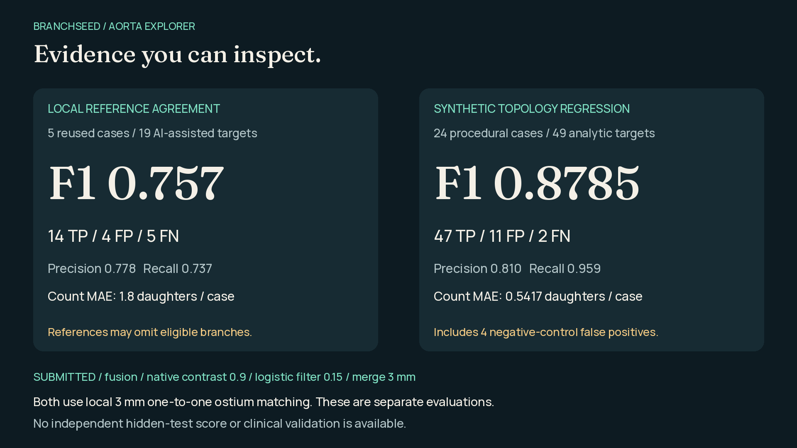

# Branchseed — Toralis Labs Challenge

Detect direct daughter arteries from a CT volume and a supplied parent-aorta mask, and export each opening as a separate branch instance in physical LPS coordinates.

**Current default:** strict + review proposals at native contrast scale **0.9**, bundled logistic filtering at **0.15**, then strict-first merging within **3 mm**. CLI, batch and the Explorer use this workflow. Five-reference replay gives **F1 0.75676 (14 TP / 4 FP / 5 FN)**. Use `--pipeline strict` for the previous 1.2 baseline (8 / 3 / 11, F1 0.5333).

**Judges: [download the standalone fusion application](application/README.md).**
The Windows offline ZIP includes only inference code, its small bundled model
and numeric runtime wheels. No website, Node/npm, matplotlib, training framework
or repository clone is needed. [Exact installation and run commands](application/START_HERE.md)
· [Package validation and runtime measurements](application/VERIFICATION.md).


[Watch the showcase](https://github.com/Coder-Meet/battleoftheschool/releases/download/branchseed-final-2026-09-13/branchseed-showcase.mp4) · [View on Google Drive](https://drive.google.com/file/d/1JvuW4ZvMwT6x4_I_VQ8jplEnPNiR_hV5/view?usp=sharing) · [Devpost copy](DEVPOST_SUBMISSION.md) · [Presenter briefing](PRESENTER_BRIEFING.md)

**[Download the complete current submission kit](https://github.com/Coder-Meet/battleoftheschool/releases/download/branchseed-submission-fusion-2026-09-13/branchseed-submission-fusion-kit.zip):** editable PPTX, PDF, five-minute speaking script, showcase video, Devpost copy and gallery. The deck, notes and charts describe the selected fusion workflow. The showcase and interface screenshots retain historical UI footage; their visible counts and timings are not current performance evidence.

| Selected fusion evidence | Result |
|---|---|
| Five reused reference cases, local 3 mm matching | **F1 0.757 · precision 77.8% · recall 73.7%** |
| Reference matches / extras / misses | **14 / 4 / 5**, daughter-count MAE **1.8** |
| 24 synthetic topology cases | F1 **0.8785**, **47 / 11 / 2**, including four negative-control detections |
| Standalone offline replay, all 25 scans | **11.60 s mean · 52.67 s maximum · 1499 MiB sampled peak RSS** |

Reference and synthetic scores measure different cohorts. These are development results, not an official weighted score or hidden-test accuracy. Runtime is measured under four-core Linux affinity; organizer-Windows timing remains unmeasured.



| Start here | Purpose |
|---|---|
| [Current workflow](PRODUCTION_WORKFLOW.md) | What runs, settings, outputs and explicit alternatives |
| [Demo guide](DEMO_GUIDE.md) | Setup, Windows offline execution, live demo and release bundles |
| [Judge application](application/README.md) | Standalone inference package and its builder |
| [Presentation](presentation/README.md) | Deck, showcase, speaker notes and the evidence the slides cite |

## Repository layout

```
run.py, batch.py, pipeline.py          CLI entry points and the score-before-merge workflow
detector.py, origin_recovery.py        Deterministic detector stages and the opt-in wall-connection recovery
learning.py                            13-feature candidate model used by the bundled filter
nifti_io.py                            NIfTI reading, including gzip streams saved with a .nii extension
explorer.py, web/                      Local Explorer server and its Vite frontend
evaluate.py, score_references.py       One-to-one ostium scoring against the reference set
synthetic.py, stress.py, benchmark.py  Synthetic regression cohorts and labelled-bundle scoring
models/production-v1/                  Bundled logistic weights, hash-checked at load time
application/                           Judge package builder, pinned inference requirements, run guide
presentation/                          Deck builders, showcase, cues and the evidence receipts the slides cite
data/                                  25 original CT/parent-mask pairs, tracked with Git LFS
eval/, labels/organizer-v1/            Released five-case annotation package and the 19 normalized references
docs/media/, docs/fusion-restored-validation.json   README graphics and the current validation receipt
tests/                                 Regression suite for the modules above
```

The research stack, the strict-release evaluation replay and their frozen evidence were removed from the working tree on 2026-09-13. They remain in git history before that cleanup commit.

## Setup

Use Python **3.13.3** with the pinned requirements. Resolve Git LFS scans while connected:

```bash
git lfs install
git lfs pull
python -m venv .venv313
```

Activate the environment for your platform, then install runtime dependencies:

```bash
python -m pip install --only-binary=:all: -r requirements.txt
```

For development checks, also install `requirements-dev.txt`. See [DEMO_GUIDE.md](DEMO_GUIDE.md) for exact Windows PowerShell commands and offline wheel installation.

## Run the pipeline

```bash
python run.py --image data/subject019/orig19.nii \
  --aorta-mask data/subject019/mask19.nii \
  --output predictions/subject019.json \
  --diagnostics predictions/subject019-diagnostics.json

python batch.py --data-root data --output-dir predictions/release-check
```

Use the required CLI with no extra flags for submission. The default minimum origin diameter is 2 mm, distinct from the 0.7 mm minimum seed-radius setting. The detector retains its native-voxel uncertainty policy for borderline or unresolved origin measurements.

The output JSON contains the parent and daughter instances with ostium, seed, radius and direction. The seed is placed 5 mm along the estimated proximal path; tracing extends to 10 mm or an estimated downstream bifurcation. Diagnostics contain paths, proposal counts, rejection reasons, filter decisions, intensity measurements and timing.

Inference runs locally without internet or model downloads. SimpleITK uses four threads by default; set `OPENBLAS_NUM_THREADS`, `OMP_NUM_THREADS`, `MKL_NUM_THREADS` and `ITK_GLOBAL_DEFAULT_NUMBER_OF_THREADS` to 4 before starting Python to cap the other library thread pools.

Explicit alternatives: `--pipeline strict` runs the unfiltered strict detector, and `--pipeline strict --recover-connected-origins` adds guarded wall-connection recovery (local F1 0.5806, count MAE 2.2). Recovery combined with fusion is rejected because that combination has not been validated.

## Explorer demo

Build the frontend once while connected, then run the local server:

```bash
npm --prefix web ci
npm --prefix web run build
python explorer.py --data-root data --port 8000
```

Open **http://127.0.0.1:8000** on the same machine. The normal Explorer shows the filtered fusion predictions. `python explorer.py --review-mode` exposes the loose review pool for annotation; that mode is not the submission configuration.

## Data and evaluation

- `data/`: 25 original CT/parent-mask pairs, tracked with Git LFS.
- `eval/data/` and `eval/docs/`: the released five-case annotation package, preserved byte-for-byte.
- `labels/organizer-v1/references/`: 19 normalized judge-approved targets across subjects019–023.

The reference package is AI-assisted and non-exhaustive. Local one-to-one ostium matching at 3 mm gives the default **14 TP / 4 FP / 5 FN**, F1 **0.75676**, count MAE **1.8**. These are reused development references, not independent clinical accuracy or an official weighted challenge score. Unknown reference radii remain unknown. The 24-case synthetic comparison gives fusion 47 / 11 / 2 (F1 0.8785), including four negative-control FPs; strict scores 46 / 0 / 3 on the same cohort.

```bash
python batch.py --cases subject019 subject020 subject021 subject022 subject023 \
  --output-dir outputs/test-labelled
python score_references.py --references labels/organizer-v1/references \
  --predictions outputs/test-labelled --data-root data --output outputs/test-labelled/metrics.json
```

`score_references.py` normalizes the organizer references, masks their unknown radii and reports 2/3/5 mm scores. `evaluate.py` is the underlying pairwise matcher; it requires finite radii on both sides, so use it with your own complete references rather than the organizer files directly.

Current validation is recorded in [the restored workflow receipt](docs/fusion-restored-validation.json).

## Verification and collaboration

```bash
python -m pytest -q
ruff check .
mypy
npm --prefix web run lint
npm --prefix web run typecheck
npm --prefix web test
npm --prefix web run build
```

Native organizer-Windows/four-core/8-GB acceptance testing and organizer/Devpost submission remain team actions; a successful local run or GitHub release does not complete them.

The team works directly on `main`: pull before editing, commit small changes and push without force-pushing. Use fresh output directories. Keep original scans, references and the bundled model intact.
